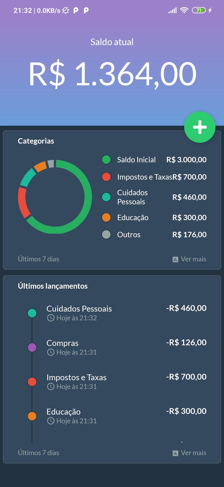
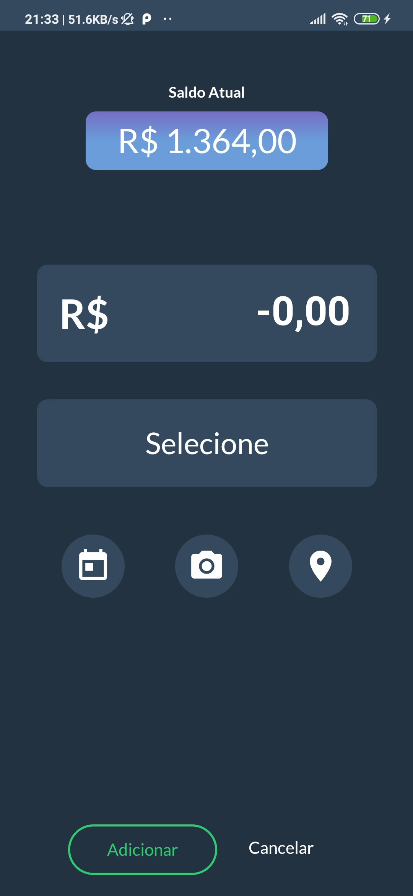
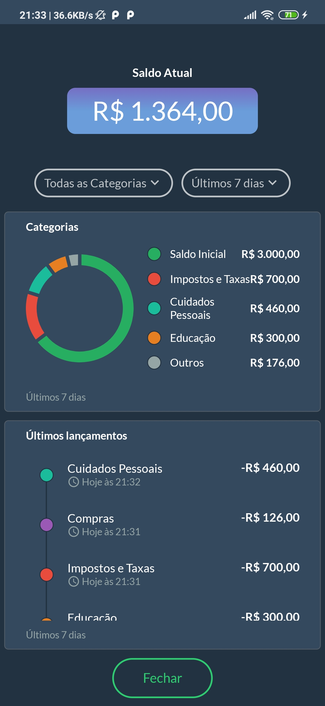

<h1 align="center">
 
  
 
 
Smart Money
</h1>

 

 :money_with_wings: Bem vindo ao Smart Money - seu aplicativo de controle de finanças pessoais. :money_with_wings: 

 

  

 

# Screenshots

        

## :suspect: Tecnologias

### Esse app foi desenvolvido com:

- ⚛️ **React Native**
- :ocean: **RealmDB**

## :gear: Funcionalidades

### :chart: Gastos e Ganhos
- Controle financeiro não se trata apenas de gastos. Você decide o tipo de lançamento que quer fazer!

### :calendar: Calendário
- Tem gastos programados para o futuro? Sem problemas! Escolha uma data personalizada para o seu lançamento!

### :camera: Camera
- Está receoso em esquecer de onde veio aquele gasto? Tire uma foto da nota fiscal, ou do estabelecimento em questão, e consulte sempre que precisar!

### :earth_americas: Localização
- Marcar o local do lançamento é o bastante pra você? Salve sua localização atual utilizando a funcionalidade de geolocalização!

### :receipt:	Relatórios filtrados
- Deseja ver seus lançamentos registrados na última semana? Ou quem sabe os do último mês? E que tal filtrar seus lançamentos por categorias? Você decide quais lançamentos visualizar no relatório.

### :chart: Gráficos
- Veja as estatísticas dos seus lançamentos através de gráficos! Os gráficos fazem um balanço dos lançamentos de maior valor nos últimos 7 dias.

## ⚛️ Sobre o projeto

O Smart Money é um aplicativo que foi desenvolvido com a mentoria do professor [Felipe Fontoura](https://devsamurai.com.br/), no programa "Meu Primeiro Aplicativo", e tem como finalidade colocar em prática os conceitos aprendidos durante o curso. Durante o desenvolvimento da aplicação, pude colocar em prática os conceitos de **Componentes**, **React Navigation**, **Props**, **States**, **CRUD**, **Banco de dados NoSQL**, **UX/UI**, **Hooks**, **LogicHooks**, **Gráficos no React Native**, **Dispositivos (nesse aplicativo utilizamos câmera e geolocalização)**, e muitos outros.

## :iphone: Instalação

1. Tenha certeza de que você tem um ambiente de desenvolvimento React Native básico configurado em seu computador ([Veja como configurar o seu ambiente de desenvolvimento](https://reactnative.dev/docs/environment-setup))

2. No diretório principal do projeto, instale as dependências utilizando o `yarn`, ou o seu gerenciador de pacotes favorito.
 
     - Rode o comando `yarn android`, para iniciar o projeto no seu dispositivo android (tenha certeza de que seu celular está conectado ao computador via USB, ou que seu emulador está devidamente configurado)

     - Rode o comando `yarn ios`, para iniciar o projeto no seu dispositivo ios (tenha certeza de que seu celular está conectado ao computador via USB, ou que seu emulador está devidamente configurado)

     - Obs.: Se estiver utilizando o Linux, rode primeiro o comando `yarn start`, e depois rode o comando `yarn android`.

###### :feelsgood: Made with :hearts: and :droplet: (tears) :feelsgood:
